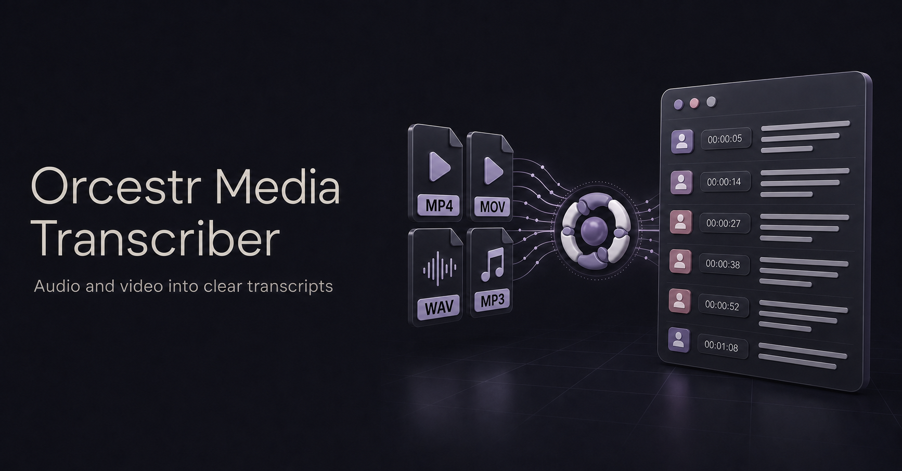

  <a href="./README.md">English</a> · <strong>Русский</strong>

  

# Orcestr Media Transcriber

Превращает локальные аудио- и видеофайлы в MP3 и читаемые текстовые транскрипты через OpenAI.

Orcestr Media Transcriber помогает обрабатывать созвоны, голосовые заметки, демо, интервью и другие записи без ручной подготовки и нарезки медиа. Перетащи или выбери несколько файлов, укажи нужный результат и отслеживай каждый файл в общей очереди.

Часть экосистемы [Orcestr](https://orcestr.com).

## Что умеет

- Обрабатывать несколько локальных аудио- и видеофайлов за один запуск.
- Создавать `.mp3`, `.txt` или оба формата.
- Сохранять результаты рядом с исходным файлом под тем же базовым именем.
- Показывать отдельный прогресс для каждого файла в реальном времени.
- Предварительно просматривать, копировать и скачивать готовые транскрипты.
- Автоматически извлекать аудио из видео.
- Разбивать длинные записи на удобные для обработки части.
- По возможности выравнивать границы частей по тишине.
- Параллельно обрабатывать файлы и части транскрипции.
- Автоматически повторять запросы при временных ошибках транскрибации.

## Как это работает

1. Перетащи файлы в приложение или выбери их через диалог.
2. Выбери MP3, транскрипт или оба результата.
3. Запусти обработку и следи за прогрессом каждого файла.
4. Открой готовые файлы рядом с оригиналами.

Длинные записи конвертируются через `ffmpeg`, разбиваются на аудиочасти и отправляются в OpenAI для транскрибации. Для создания транскрипта нужны API-ключ OpenAI и подключение к интернету. Ключ вводится в приложении и хранится локально на устройстве.

## Поддерживаемые платформы

- Windows x64
- macOS x64 и Apple Silicon
- Linux x64

Desktop-приложение уже включает всё необходимое для обработки медиа. Пользователю не нужны Python, Node.js и отдельная установка FFmpeg.

## Ссылки

- [Страница продукта](https://orcestr.com/ru/media-transcriber)
- [Orcestr](https://orcestr.com)
- [Обзор Orcestr](https://github.com/Artasov/orcestr-overview)
- [Как помочь проекту](./CONTRIBUTING.md)
- [Безопасность](./SECURITY.md)
- [Лицензия](./LICENSE)
